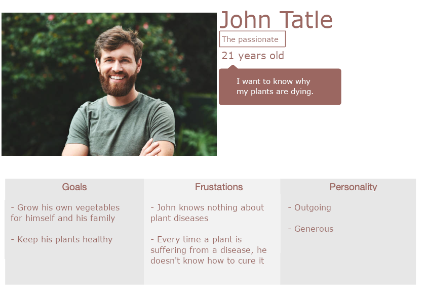
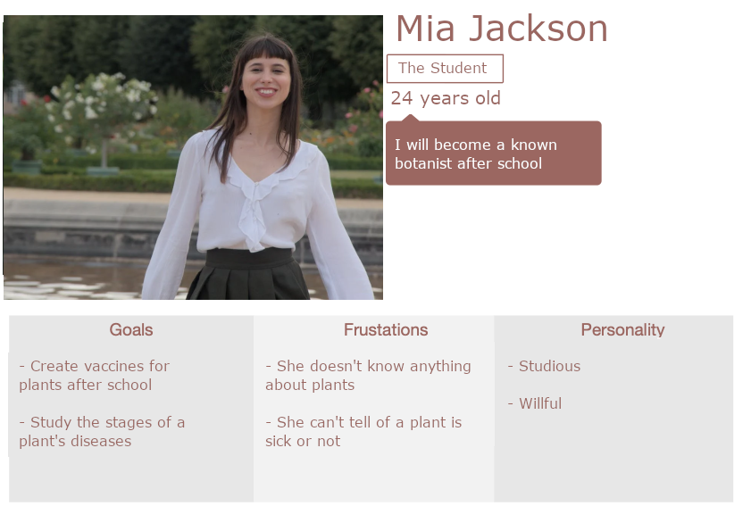
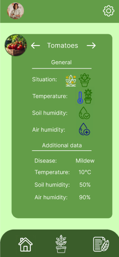

 

# Functional Specifications

Aurélien Fernandez  
Created the: 27/02/2023  
Last update: 19/03/2024

 

Table of content

- [Functional Specifications](#functional-specifications)
  - [1 Overview](#1-overview)
    - [1.1 Introduction](#11-introduction)
    - [1.2 Project definition](#12-project-definition)
      - [1.2.1 Project scopes](#121-project-scopes)
      - [1.2.2 Personas](#122-personas)
      - [1.3 Design](#13-design)
        - [1.3.1 Colors](#131-colors)
        - [1.3.2 User path](#132-user-path)
    - [2. Project organisation](#2-project-organisation)
      - [2.1 Project representatives](#21-project-representatives)
      - [2.2 Stakeholders](#22-stakeholders)
      - [2.2 Milestones](#22-milestones)
      - [2.3 Resources/Financial Plan](#23-resourcesfinancial-plan)
      - [2.4 Assumptions and constraints](#24-assumptions-and-constraints)
    - [3. Functional requirements](#3-functional-requirements)
    - [3. Non-functional requirements](#3-non-functional-requirements)
    - [Glossary](#glossary)

## 1 Overview

### 1.1 Introduction

This Project is OLAF, which stands for OnLine Automated Farm. As the name suggests, it is an automated farm or more precisely an automated plant pot linked to a mobile app to take care of plants automatically. The app will display in real time the multiple data collected by the planter. The main aspect of the project is that both the planter and the app will be able to take images of the plant's leaves to detect if a disease is currently degrading the plant.

### 1.2 Project definition

#### 1.2.1 Project scopes

| **In scope**                                                                                    |
| ----------------------------------------------------------------------------------------------- |
| The plant pot collects data (temperature/soil humidity) in real time.                           |
| The plant pot reacts to the data to benefit the plant                                           |
| The plant pot takes images of the plant's leaves                                                |
| The plant pot detects infections from the image                                                 |
| The plant pot send data and alerts of infections to the user's app                              |
| The app gets and displays the data sent by the plant pot                                        |
| The app helps the user to prevent infections and cure plants                                    |
| The app can take images and detect infections                                                   |
| The app will possess at least 2 languages: english and french                                   |
| The app will possess at least 2 themes, a normal one and one for color-blindness                |
| A website to be able to modify and maintain the app without going through the server-side setup |

| **Out of Scope**                                                                                                                                    |
| --------------------------------------------------------------------------------------------------------------------------------------------------- |
| The regulation of the plants temperature as it requires heating or cool down the plants, thus required a structure around it or additional hardware |
| The collection of fruits/vegetable, as it would require a robotic arm                                                                               |

| **Nice to have**                                                                                    |
| --------------------------------------------------------------------------------------------------- |
| A solar panel to allow the pot to be place outside and to operate indepentantly                     |
| A moving camera, as it would increase the probability to detect an infection if a plant is infected |
| The app is translated in other languages                                                            |

#### 1.2.2 Personas

   
   
   

#### 1.3 Design

##### 1.3.1 Colors

The app will possess a theme with the colors being mainly based on green-like colors: (in hexadecimal):
- Main color: #395B29,
- Secondary color: #629B47,
- Background color: #CEFFB7,
- Text color: white #FFFFFF,

The icons are all outlined icons. The icons used for navigation are only in white. The icon for the "disease finder" present on the home page uses the main color. Finally, the icons representing diseases are in white and yellow.

 ##### 1.3.2 User path

 The whole design can be found at this link: [mockup](https://www.figma.com/file/DoUbOuhffl67LVhORlBwRm/OLAF?type=design&node-id=0%3A1&mode=design&t=WksEdMbG9RSFOoLp-1).

 The first page is the connection page, it will appear only the first time or after the user has disconnected his account. If the app has been opened for the first time, it shows a small window to set up the color theme, to permit color-blind people to see the app correctly.

 

Next, the users will be on the home page, they will be able to navigate thanks to the navigation bar that will always be present at the bottom of the pages.

The home page displays the names and images of all plants. the name can be modified by the user but the images are set when specifying the plant species when connecting a new planter. 

The Home page also possesses a small icon at the bottom right which is the "disease finder", it requires the user's agreement to use their camera. Finally, by taking a picture of a vegetable's leaves, it will find out if there is an infection or not.

 

Additionally, if one or multiple plants are infected, the home page will display it.

 
  
 
  
 

Then, there is the "plants' status" page, which displays the status and information of a plant linked to the account. Users can see the data collected by the planter's sensors, including the ambient temperature, the soil and air humidity and the plant's current state, if it is infected or not.

 
  
 
  
 
  
 
  
 
  
 

The third page is the lexica, which allows users to learn about plants and the diseases related to each plant. It shows users images of the disease and how to prevent/cure a disease.

 
  
 
  
 
  
 
  
 

Finally, there is the settings page, with multiple settings such as account management, language, the color themes for blindness and other pages about confidentiality, terms of use and licenses.

 

### 2. Project organisation

#### 2.1 Project representatives

| Project Owner      |
| ------------------ |
| Aurélien Fernandez |

| Project Sponsor |
| --------------- |
| ALGOSUP         |

The project sponsors are expected to:
- Approve the idea of the project 
- Grade the project after a presentation in front of a jury after the project's completion

#### 2.2 Stakeholders

| Stakeholders       | Role                                                     |
| ------------------ | -------------------------------------------------------- |
| Aurélien Fernandez | Lead and develop the project                             |
| ALGOSUP            | Provide projects's approval and the grade of the project |
| Jury               | Evaluate the project                                     |

#### 2.2 Milestones

| Objective                           | Description                                                                          |
| ----------------------------------- | ------------------------------------------------------------------------------------ |
| Functional specifications           | Creation of the document to describe all features and objectives                     |
| Technical specifications            | Creation of the document to describe all technical aspects of the project            |
| Servers and back-end resources      | The servers and back-end resources used by the project                               |
| Front-end                           | The app is created along with its design and the connection with the backend is done |
| Users' reviews                      | Give the project to users to test and give feedback                                  |
| Administrator's website             | Create the website to allow administrators to maintain the project                   |
| V1 presentation                     | Present the first version of the project in front of a jury                          |
| Connected Planter                   | Create the autonomous planter and connect it to the backend                          |
| Modify the app using user's reviews | From the users' feedback maintain and upgrade the project                            |
| Users' review                       | Give for a second time the products to user's to get their feedback                  |
| V2 presentation                     | Present the second version of the project in front of a jury                         |

#### 2.3 Resources/Financial Plan

As the only representative of this project, I do not have any limitations regardless of the cost of the project. However, I aim for a cost-effective solution.

**Resources allocation:**

- Project duration: The project is scheduled to plan from the creation of this document to the end of my schooling. An increase in time may be necessary to improve or continue the project afterward.
- Time allocated to the project: As the project is to be worked on outside of school the number of hours per week has a high chance to vary depending on my personal/work life.

#### 2.4 Assumptions and constraints

| Assumptions                                                                                                                                               |
| --------------------------------------------------------------------------------------------------------------------------------------------------------- |
| The phone of the users are able to download and run mobile apps                                                                                           |
| Users are able and will react in case of a plant infection                                                                                                |
| The number of hours on the project is 5 hours per week days in average and 12 hours in weekend in average, giving a total of 17 hours per week in average |
| The images analysed by the AI are only images of plants which leaves can be analysed by the AI                                                            |

| Constraints                                                                                       |
| ------------------------------------------------------------------------------------------------- |
| The users must be able to download the app, at least on Android phones                            |
| The energy consumption of the pot must not be too high, as it must benefit the user               |
| The app must be responsive for all kind of mobile phone's sizes                                   |
| The AI used to detect infections must have a success rate over 98% to achieve a satisfactory rate |
| In case of a crash from the servers the mobile app may not be updated                             |

### 3. Functional requirements

The project must achieve multiple requirements to be considered successful:
| Requirement             | Definition                                                                                               |
| ----------------------- | -------------------------------------------------------------------------------------------------------- |
| Energy access           | The planter must access a source of energy to be able to operate                                         |
| AI precision            | The AI used to identify plants and diseases must operate with a minimum of 98% success rate              |
| Planter sensors         | The planter must be able to collect data from its sensors, whether it is temperature, humidity or images |
| Planter communication   | The planter must be able to send data to the servers and update user's data                              |
| User accounts           | The users must be able to connect to an account and retrieve data of their planters from the servers     |
| Mobile app              | The mobile app must be able to update user's data and display information retrieved from it              |
| Disease notification    | The users must be informed in case of infection from a notification and it must be displayed on the app  |
| Administrator's website | The website used by administrators must be operational and be able to update the app                     |

### 3. Non-functional requirements

| The project must also achieve multiple non-functional requirements: 
| Requirement                         | Definition                                                                                                                |
| ----------------------------------- | ------------------------------------------------------------------------------------------------------------------------- |
| Accessibility                       | The planter and the mobile app must be accessible to all users, whether from their language or in case of color-blindness |
| Updates frequencies                 | The mobile app must update the planters data with a frequency of 2 per hours minimum                                      |
| Mobile app & website responsiveness | The mobile app and the website must be responsive to scale with the user's phone/computer size                            |
| Mobile app & website reaction time  | The time between a user's action and the app/website response must not exceed 0.01ms                                      |

### Glossary
