
 

# Functional Specifications

Aurélien Fernandez  
Created the: 27/02/2023  
Last update: 25/02/2024

 

Table of content

- [Functional Specifications](#functional-specifications)
  - [I Overview](#i-overview)
    - [1. Introduction](#1-introduction)
    - [2. Project definition](#2-project-definition)
      - [2.1 Project scopes](#21-project-scopes)
      - [2.2 Project organisation](#22-project-organisation)
      - [2.3 Users](#23-users)
    - [3. Project plan](#3-project-plan)
      - [3.1 Resources/Financial Plan](#31-resourcesfinancial-plan)
      - [3.2 Assumptions and constraints](#32-assumptions-and-constraints)
    - [Glossary](#glossary)

## I Overview

### 1. Introduction

This Project is OLAF, which stands for OnLine Automated Farm. As the name suggests, it is an automated farm or more precisely an automated plant pot linked to a mobile app to take care of plants automatically. The app will display in real time the multiple data collected by the planter. The main aspect of the project is that both the planter and the app will be able to take images of the plant's leaves to detect if a disease is currently degrading the plant.

### 2. Project definition

#### 2.1 Project scopes

| **In scope**                                                                                    |
| ----------------------------------------------------------------------------------------------- |
| The plant pot collects data (temperature/soil humidity) in real time.                           |
| The plant pot react to the data to benefit the plant                                            |
| The plant pot takes images of the plant's leaves                                                |
| The plant pot detects infections from the image                                                 |
| The plant pot send data and alerts of infections to the user's app                              |
| The app gets and display the data sent by the plant pot                                         |
| The app help the user to prevent infections and cure plants                                     |
| The app can take images and detect infections                                                   |
| The app will possess at least 2 languages: english and french                                   |
| The app will possess at least 2 themes, a normal one and one for color-blindness                |
| A website to be able to modify and maintain the app without going through the server-side setup |

| **Out of Scope**                                                                                                                                    |
| --------------------------------------------------------------------------------------------------------------------------------------------------- |
| The regulation of the plants temperature as it requires heating or cool down the plants, thus required a structure around it or additional hardware |
| The collection of fruits/vegetable, as it would require a robotic arm                                                                               |

| **Nice to have**                                                                                    |
| --------------------------------------------------------------------------------------------------- |
| A solar panel to allow the pot to be place outside and to operate indepentantly                     |
| A moving camera, as it would increase the probability to detect an infection if a plant is infected |
| The app is translated in other languages                                                            |

#### 2.2 Users

#### 2.3 Design

##### 2.3.1 Colors

The app will possess a theme with the colors being mainly based on green-like colors: (in hexadecimal):
- Main color: #395B29,
- Secondary color: #629B47,
- Background color: #CEFFB7,
- Text color: white #FFFFFF,

The icons are all outlined icons. The icons used for navigation are only in white. The icon for the "disease finder" present on the home page uses the main color. Finally, the icons representing diseases are in white and yellow.

 ##### 2.3.2 User path

 The whole design can be found at this link: [mockup](https://www.figma.com/file/DoUbOuhffl67LVhORlBwRm/OLAF?type=design&node-id=0%3A1&mode=design&t=WksEdMbG9RSFOoLp-1).

 The first page is the connection page, it will appear only the first time or after the user has disconnected his account.

 

Next, the users will be on the home page, they will be able to navigate thanks to the navigation bar that will always be present at the bottom of the pages.

The home page displays the names and images of all plants. the name can be modified by the user but the images are set when specifying the plant species when connecting a new planter. 

The Home page also possesses a small icon at the bottom right which is the "disease finder", it requires the user's agreement to use their camera. Finally, by taking a picture of a vegetable's leaves, it will find out if there is an infection or not.

 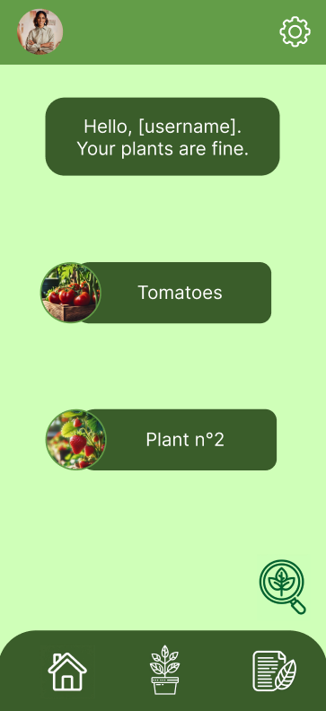

Additionally, if one or multiple plants are infected, the home page will display it.

 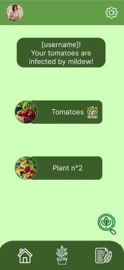

 
 
 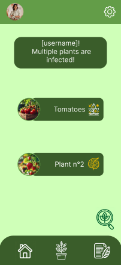

Then, there is the "plants' status" page, which displays the status and information of a plant linked to the account. Users can

 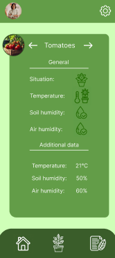

 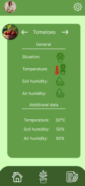
 
 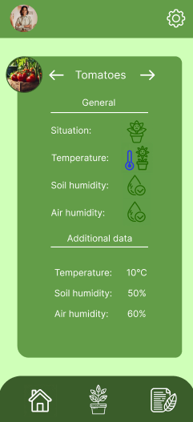

 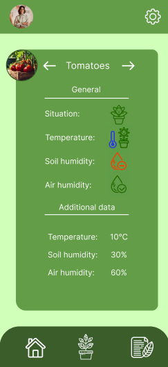

 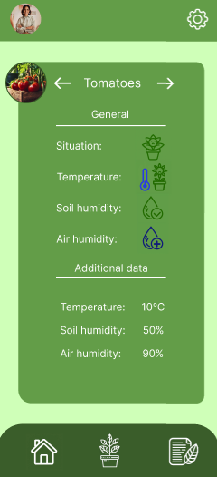

The third page is the lexica, which allows users to learn about plants and the diseases related to each plant. It shows users images of the disease and how to prevent/cure a disease.

 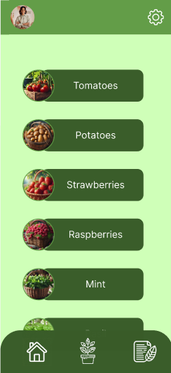

 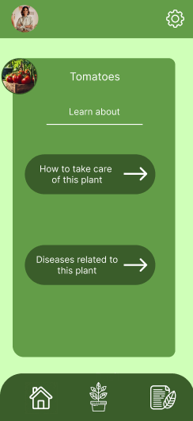
 
 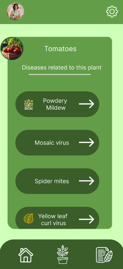

 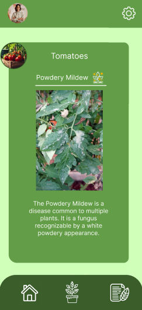

 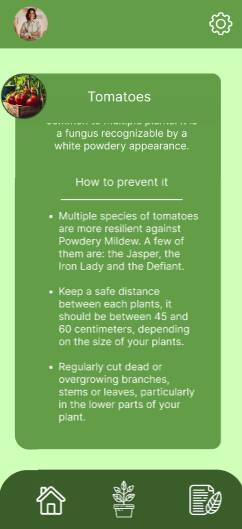

Finally, there is the settings page, with multiple settings such as account management, language, the color themes for blindness and other pages about confidentiality, terms of use and licenses.

 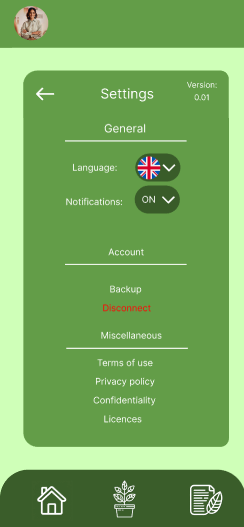

### 3. Project plan

#### 3.1 Resources/Financial Plan

As the only representative of this project, I do not have any limitations regardless of the cost of the project. However, I aim for a cost-effective solution.

**Resources allocation:**

- Project duration: The project is scheduled to plan from the creation of this document to the end of my schooling. An increase in time may be necessary to improve or continue the project afterward.
- Time allocated to the project: As the project is to be worked on outside of school the number of hours per week has a high chance to vary depending on my personal/work life.

#### 3.2 Assumptions and constraints

| Assumptions                                                                                    |
| ---------------------------------------------------------------------------------------------- |
| The phone of the users are able to download and run mobile apps                                |
| Users are able and will react in case of a plant infection                                     |
| The number of hours on the project is almost of 5 hours per week in average                    |
| The images analysed by the AI are only images of plants which leaves can be analysed by the AI |

| Constraints                                                                                       |
| ------------------------------------------------------------------------------------------------- |
| The users must be able to download the app, at least on android phones                            |
| The energy consumption of the pot must not be too high, as it must benefit the user               |
| The app must be responsive for all kind of mobile phone's sizes                                   |
| The AI used to detect infections must have a success rate over 98% to achieve a satisfactory rate |
| In case of crash from the servers the mobile app may not be updated                               |

### Glossary
