
 

# Written report

Aurélien Fernandez  
Created the: 27/02/2023  
Last update: 21/03/2024

 

Table of content

- [Written report](#written-report)
  - [1 - Overview](#1---overview)
    - [1.1 - Context](#11---context)
    - [1.2 - The idea](#12---the-idea)
  - [2 - Project definitions](#2---project-definitions)
    - [2.1 - Targeted audience](#21---targeted-audience)
    - [2.2 - Scopes](#22---scopes)
      - [2.2.1 - In scopes](#221---in-scopes)
      - [2.2.2 - Out of scopes](#222---out-of-scopes)
      - [2.2.3 - Nice to have](#223---nice-to-have)
    - [2.3 - Personas](#23---personas)
    - [2.4 - Design](#24---design)
      - [2.4.5 - Colors](#245---colors)
      - [2.4.6 - User path](#246---user-path)
        - [2.4.7 - Original design](#247---original-design)
        - [2.4.8 - Current design](#248---current-design)

## 1 - Overview

### 1.1 - Context

In France, most of the population possess a garden or at least a plant in a pot. This [study](https://www.lesentreprisesdupaysage.fr/content/uploads/2019/12/dossier-complet-ifop2019.pdf) from the IFOP and the UNEP (standing for "Institut Français d'Opinion Publique" and "Union Nationale des Entreprises du Paysage") shows that 63% of the french population have a garden, 58% of these gardens are private and 5% are shared between multiple people/families. This study also shows only 42% of Parisians are owning or participating in the maintenance of a garden. Finally, 70% of the participants grow either vegetable or fruits to sustains themselves or to reduce the cost of food.

Learning about this, a question arose in my mind, what can I do with these information? Then I learned that people couldn't recognize a plant disease and in consequence deal with a disease accordingly. This is how the project named OLAF began.

### 1.2 - The idea

My idea is OLAF, which stands for OnLine Automated Farm. As the name suggests, it is an automated farm or more precisely an automated plant pot linked to a mobile app to detect when a disease or a virus is infecting a plant. 

To achieve this, an AI can be used to analyze an image and detect specific patterns linked to a disease or a virus.

Additionally, the project can be divided into two sub-projects:  
the mobile app with the AI and an automated plant pot connected to the user's account on the mobile app.

## 2 - Project definitions

### 2.1 - Targeted audience

The targeted audience could be defined to anyone maintaining a plant, more particularly vegetable.

In france, using the numbers from the study mentioned earlier, it represents at least 42 million 455 thousand 700 people (63% of a population 67.39 million as in 2019).

The targeted audience could be increase by internationalizing the application.

Please notice that the targeted audience includes only people who are of legal age.

### 2.2 - Scopes

To measure the success of the project a set of scopes have been set, this ensures the projects keep tracks of the set scopes and avoid implementing features that are not required for the project.

#### 2.2.1 - In scopes

| **Mobile app**                                                                           |
| ---------------------------------------------------------------------------------------- |
| The app is accessible for any user once the authentication form is filled                |
| The app can pull a lexicon from the server                                               |
| The app displays a lexicon describing either a plant or a disease                        |
| The app can take pictures and detect diseases and viruses on a plant                     |
| The app displays the result of the analysis of the given picture                         |
| The app possess at least 2 languages: english and french                                 |
| The user can change the language of the app                                              |
| The app can communicate to the server to access the different data, lexicon or user data |

| **Desktop app**                                                                                                                         |
| --------------------------------------------------------------------------------------------------------------------------------------- |
| The desktop app is available only for users identified as administrators                                                                |
| An administrator can modify the lexicon                                                                                                 |
| An administrator can modify the AI model                                                                                                |
| An administrator can update the role of a user, elevating the user from administrator, or removing administrator access to another user |
| An administrator can pull an update from the server                                                                                     |
| An administrator can upload the changes directly into the server                                                                        |

| **Plant pot**                                                         |
| --------------------------------------------------------------------- |
| The possibility to add a plant pot to an account                      |
| The possibility to remove a plant pot from an account                 |
| The possibility to edit a plant pot of an account                     |
| The plant pot collects data (temperature/soil humidity) in real time. |
| The plant pot reacts to the data to benefit the plant                 |
| The plant pot takes images of the plant's leaves                      |
| The plant pot detects infections from the image                       |
| The plant pot send data and alerts of infections to the user's app    |
| The plant pot can water the plant when the humidity is low enough     |

#### 2.2.2 - Out of scopes

| **Out of Scope**                                                       |
| ---------------------------------------------------------------------- |
| The detection of an infection in plants that cannot fit in a plant pot |
| The collection of fruits/vegetable, as it would require a robotic arm  |

#### 2.2.3 - Nice to have

| **Nice to have**                                                                                    |
| --------------------------------------------------------------------------------------------------- |
| The app can be used on multiple platforms: IOS                                                      |
| The admin app can be used on multiple platforms: MacOs, Linux                                       |
| A solar panel to allow the pot to be placed outside and operate independently                       |
| A moving camera, as it would increase the probability to detect an infection if a plant is infected |
| The app is translated in other languages than english and french                                    |

### 2.3 - Personas

  
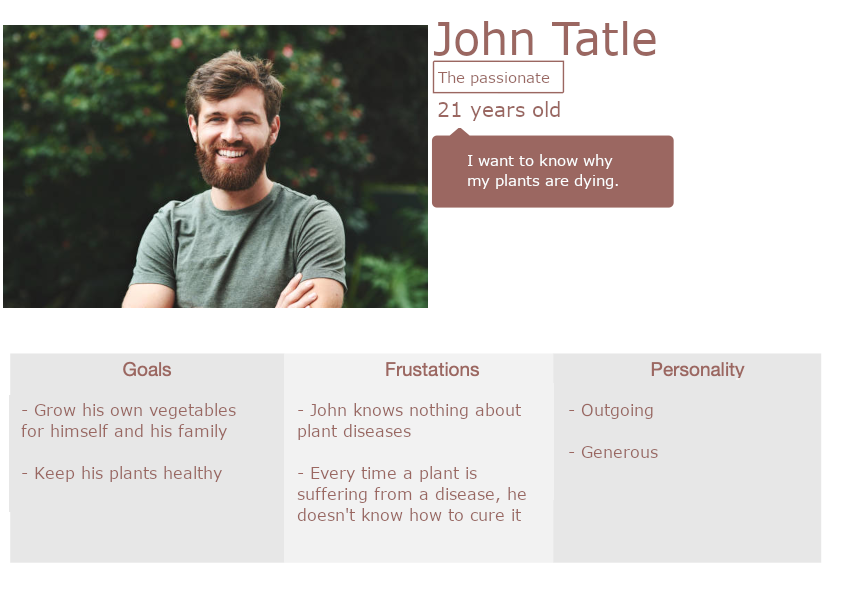  
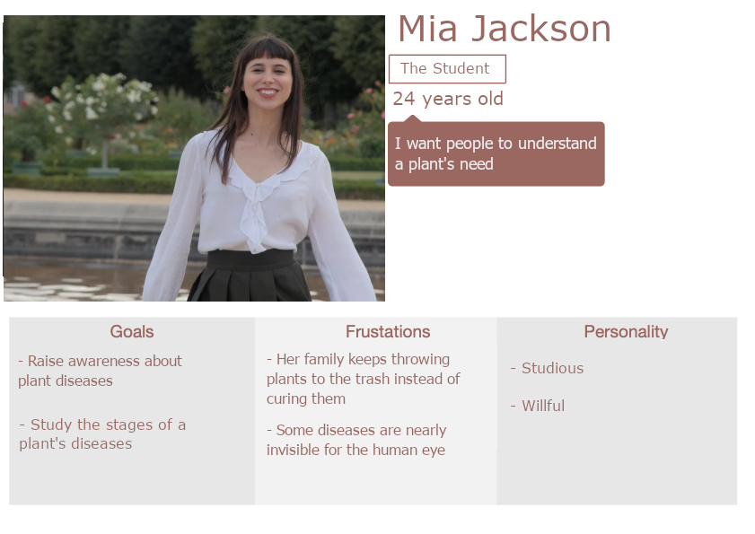  

### 2.4 - Design

#### 2.4.5 - Colors

The app will possess a theme with the colors being mainly based on green-like colors: (in hexadecimal):
- Main color: #395B29,
- Secondary color: #629B47,
- Background color: #CEFFB7,
- Text color: white #FFFFFF,

The icons are all outlined icons. The icons used for navigation are only in white. The icon for the "disease finder" present on the home page uses the main color. Finally, the icons representing diseases are in white and yellow.

 #### 2.4.6 - User path

 The current design can be found at this link: [mockup](https://www.figma.com/file/DoUbOuhffl67LVhORlBwRm/OLAF?type=design&node-id=0%3A1&mode=design&t=WksEdMbG9RSFOoLp-1).

##### 2.4.7 - Original design
 The first page is the connection page, it will appear only the first time or after the user has disconnected his account. If the app has been opened for the first time, it shows a small window to set up the color theme, to permit color-blind people to see the app correctly.

 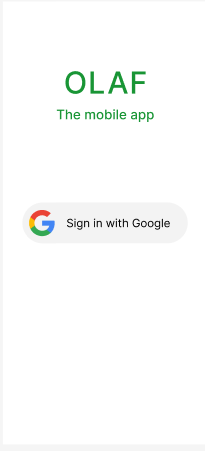

Next, the users will be on the home page, they will be able to navigate thanks to the navigation bar that will always be present at the bottom of the pages.

The home page displays the names and images of all plants. the name can be modified by the user but the images are set when specifying the plant species when connecting a new planter. 

The Home page also possesses a small icon at the bottom right which is the "disease finder", it requires the user's agreement to use their camera. Finally, by taking a picture of a vegetable's leaves, it will find out if there is an infection or not.

 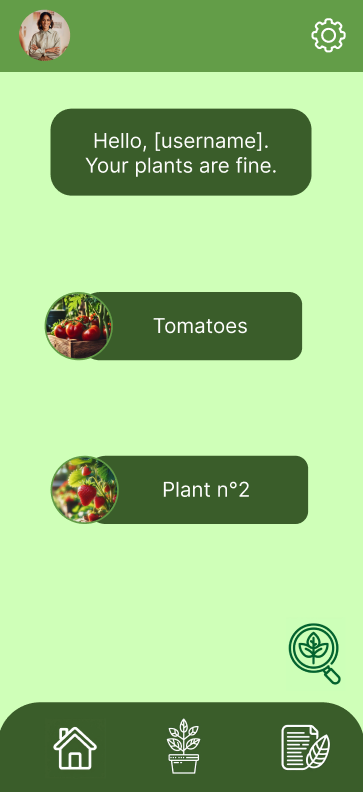

Additionally, if one or multiple plants are infected, the home page will display it.

 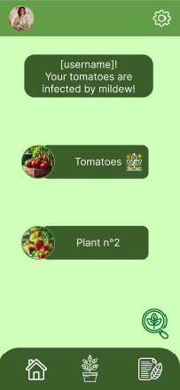
  
 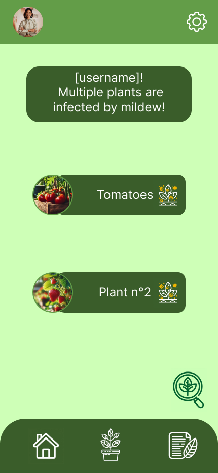
  
 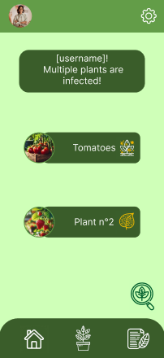

Then, there is the "plant's status" page, which displays the status and information of a plant linked to the account. Users can see the data collected by the planter's sensors, including the ambient temperature, the soil and air humidity and the plant's current state, if it is infected or not.

 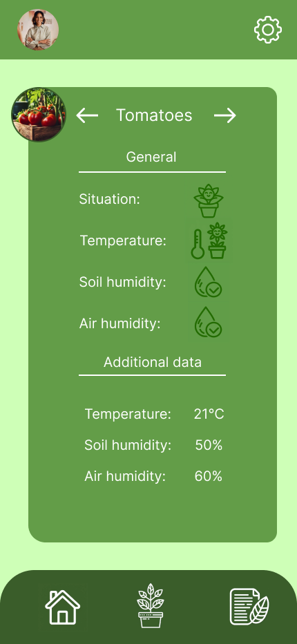
  
 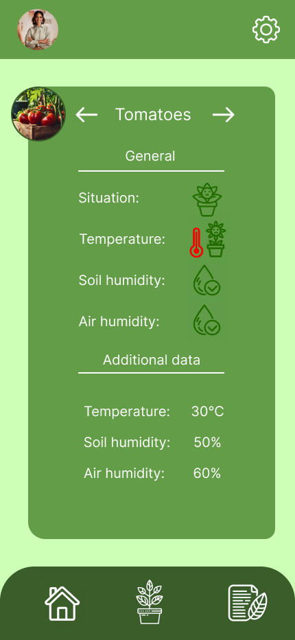
  
 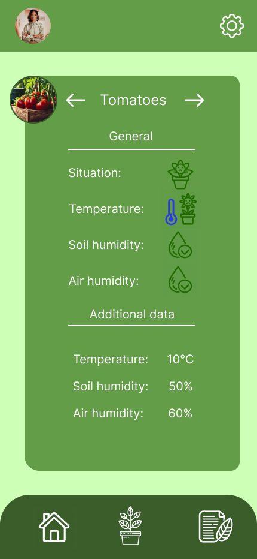
  
 
  
 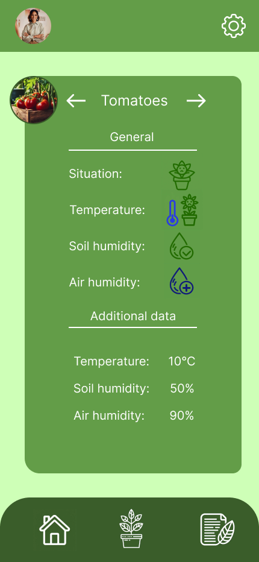
  
 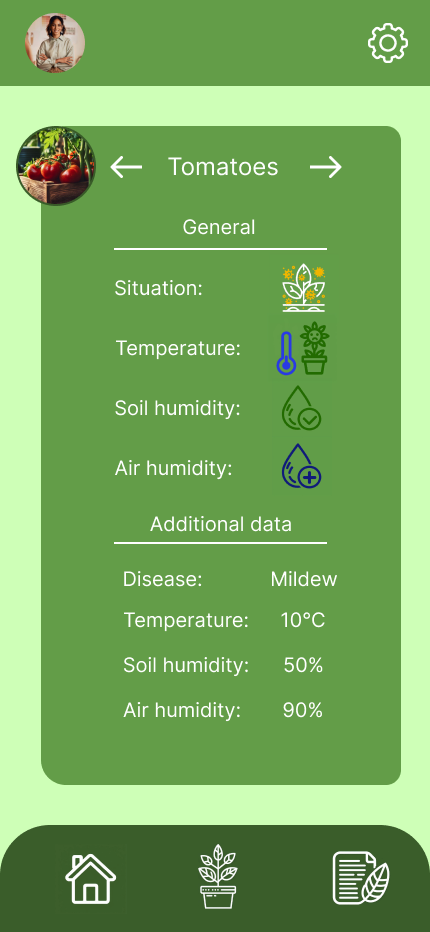

The third page is the lexicon, which allows users to learn about plants and the diseases related to each plant. It shows users images of the disease and how to prevent/cure a disease.

 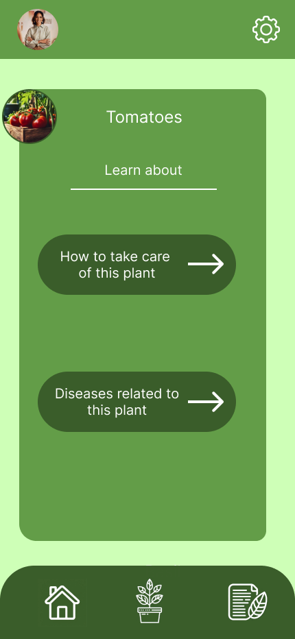
  
 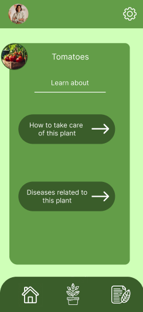
  
 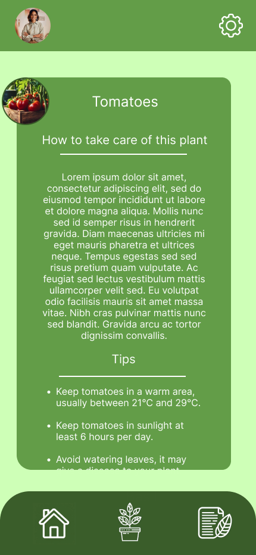
  
 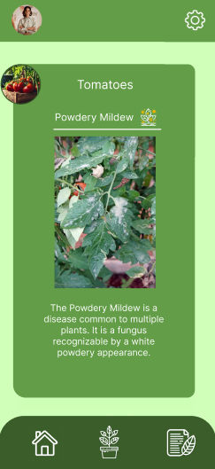
  
 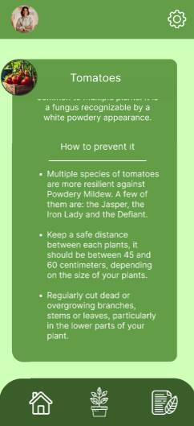

Finally, there is the settings page, with multiple settings such as account management, language, the color themes for blindness and other pages about confidentiality, terms of use and licenses.

 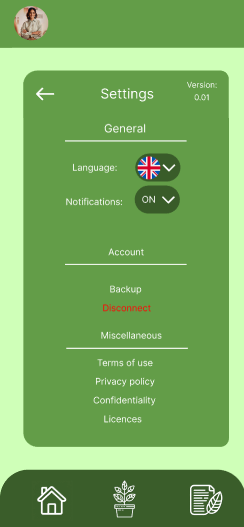

##### 2.4.8 - Current design

The current design is not entirely different from the one created at the beginning of the project. It has been updated due to the constraints linked to the different devices and the solutions used.

The following order is identical to the user path presented in [2.4.7 - original design](#247---original-design)

